# NVIDIA GRID 驱动安装与使用教程

本文面向在 FNOS / 飞牛 NAS 虚拟机中安装 NVIDIA GRID 驱动的中阶玩家（高阶玩家自己会编译），按实际操作顺序说明如何选择驱动包、安装内核空间驱动、安装用户空间驱动，并验证影视转码、相册 AI 加速和系统信息识别是否正常。

当前教程默认以 GRID 19.5 / `580.159.03` 为例。本项目也提供 GRID 16.14 / `535.309.01` 包，安装步骤相同，但必须整套选择同一驱动版本。

- 宿主机 NVIDIA 驱动：`NVIDIA-Linux-x86_64-580.159.01-vgpu-kvm-patch.run`
- 客户机 NVIDIA Grid 驱动：`580.159.03`
- 可选客户机 NVIDIA Grid 驱动：`535.309.01`
- 内核驱动包：`appstore.driver.gpu.nvidia.ko`
- 用户空间驱动包：`appstore.driver.gpu.nvidia.user`

> 重要提醒：安装驱动会修改系统内核模块、firmware、initramfs 和 NVIDIA 用户空间库。开始前务必给虚拟机打快照，方便安装失败或版本不匹配时回滚。

> 版本匹配提醒：FNOS 虚拟机里的 GRID 客户机驱动必须与宿主机上的 NVIDIA vGPU KVM 驱动匹配。本文示例使用的组合是宿主机 `NVIDIA-Linux-x86_64-580.159.01-vgpu-kvm-patch.run`，客户机 GRID 驱动 `580.159.03`，这个驱动同属于 GRID 19.5。使用 `535.309.01` 时，应搭配 GRID 16.14 分支的宿主机 vGPU KVM 驱动。不要随意混用不同 vGPU 版本分支的宿主机驱动和客户机驱动。

## 1. 安装前准备

### 1.1 确认宿主机已经准备好 vGPU

如果你的 FNOS 运行在虚拟机中，先在宿主机确认 NVIDIA vGPU 已经可用，并且虚拟机能够分配到对应的 vGPU 设备。

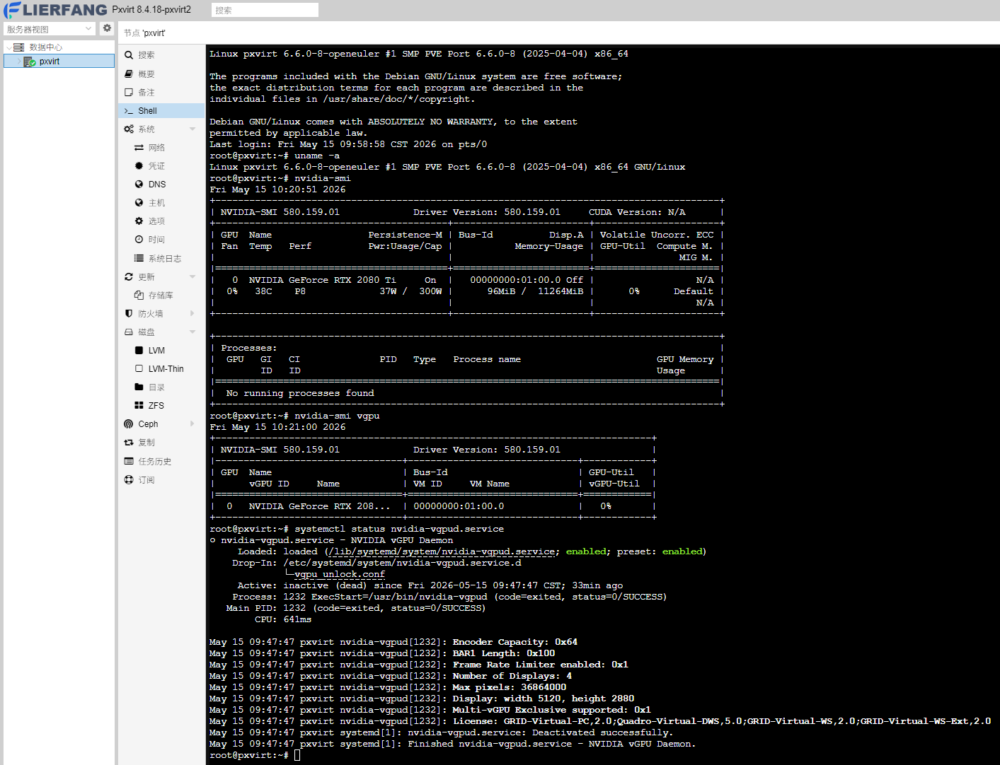

不同虚拟化平台的 vGPU 配置方式不完全相同。这里的关键点是：FNOS 虚拟机必须能看到被直通或分配进来的 NVIDIA GPU / vGPU 设备，否则后续安装驱动也无法正常使用 GPU。

同时需要确认宿主机安装的是与本文客户机 GRID 驱动匹配的 vGPU KVM 驱动。一般应从同一个 NVIDIA vGPU 驱动发布包中选择：

- 宿主机安装 `Host_Drivers` / `vgpu-kvm` 驱动
- FNOS 虚拟机安装对应的 `Guest_Drivers` / GRID 驱动

本文对应的示例组合是：

```text
宿主机：NVIDIA-Linux-x86_64-580.159.01-vgpu-kvm-patch.run
客户机：NVIDIA-Linux-x86_64-580.159.03-grid.run
```

本项目同时提供 GRID 16.14 包：

```text
宿主机：NVIDIA-Linux-x86_64-535.309.01-vgpu-kvm.run
客户机：NVIDIA-Linux-x86_64-535.309.01-grid.run
```

如果宿主机 vGPU KVM 驱动和客户机 GRID 驱动不匹配，可能出现 GPU 无法初始化、授权状态异常、`nvidia-smi` 无法识别 vGPU、或应用调用 GPU 失败等问题。

### 1.2 给虚拟机打快照

安装前先关闭或暂停关键业务，然后在虚拟化平台中给 FNOS 虚拟机创建快照。

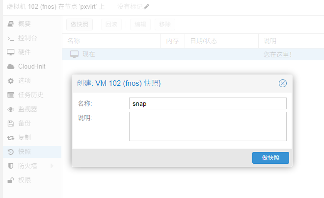

建议快照备注写清楚，例如：

```text
install-nvidia-grid-driver-before
```

如果安装后出现无法启动、驱动版本不匹配、GPU 无法识别等问题，可以直接回滚到这个快照。

### 1.3 给虚拟机添加 vGPU 设备

确认虚拟机硬件中已经添加 NVIDIA vGPU 设备。

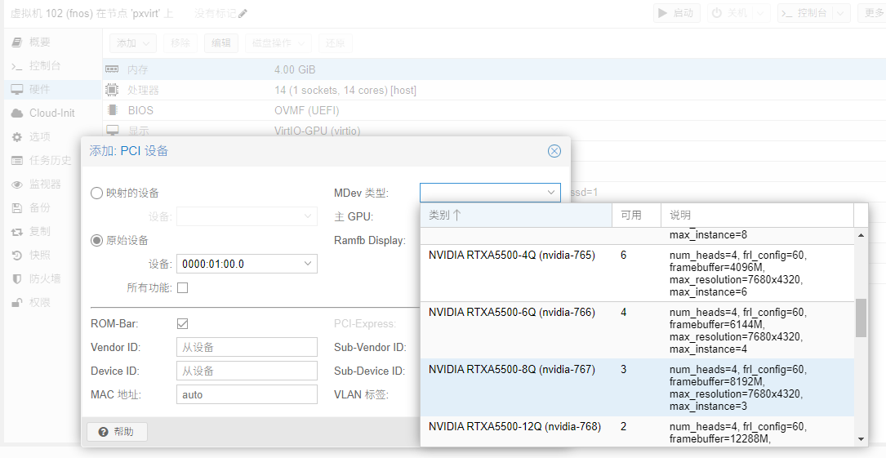

添加后启动 FNOS 虚拟机，进入系统确认设备可见。

### 1.4 确认系统版本和硬件信息

进入 FNOS 桌面后，可以先在系统设置里查看设备信息。

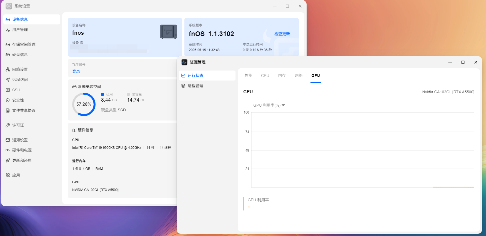

这里主要确认：

- 系统能正常启动
- CPU、内存、存储空间正常
- 后续安装成功后，GPU 信息会在这里显示

## 2. 选择正确的内核驱动包

### 2.1 查看 FNOS 内核版本和 build number

打开虚拟机控制台或 SSH，执行：

```bash
uname -a
```

示例输出：

```text
Linux fnos 6.18.18-trim #473 SMP PREEMPT_DYNAMIC Thu Apr 9 09:34:02 UTC 2026 x86_64
```

新版本系统也可能显示类似：

```text
Linux hp14q-fnos 6.18.18.c788-trim #788 SMP PREEMPT_DYNAMIC Fri Jun 12 01:42:14 UTC 2026 x86_64
```

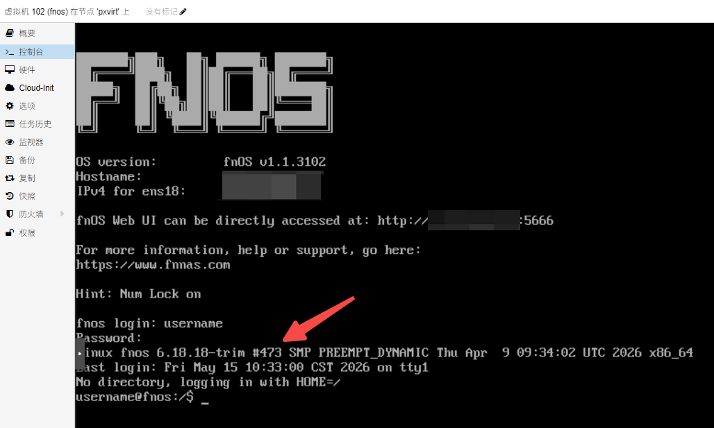

需要关注两部分：

- 内核版本：`6.18.18-trim` 或 `6.18.18.c788-trim`
- build number：`#473`

`6.18.18.c788-trim` 是单独内核 ABI，必须选择单独编译的 `6.18.18.c788-trim-amd64` 包，不能继续使用 `6.18.18-trim-717-amd64`。后续如果系统显示其他完整内核名，也需要下载与 `uname -r` 对应的内核包；没有对应包时安装会失败并提示模块目录不存在。

本项目目前提供以下内核驱动包：

| 当前内核 build number | 应选择的内核驱动包 |
| --- | --- |
| `#427` 到 `#569` | `appstore.driver.gpu.nvidia.ko-580.159.03-3-6.18.18-trim-427-amd64.tgz.fpk` |
| `#570` 到 `#586` | `appstore.driver.gpu.nvidia.ko-580.159.03-3-6.18.18-trim-570-amd64.tgz.fpk` |
| `#587` 到 `#716` | `appstore.driver.gpu.nvidia.ko-580.159.03-3-6.18.18-trim-587-amd64.tgz.fpk` |
| `#717` 到 `#787` | `appstore.driver.gpu.nvidia.ko-580.159.03-3-6.18.18-trim-717-amd64.tgz.fpk` |
| `#788` 且内核为 `6.18.18.c788-trim` | `appstore.driver.gpu.nvidia.ko-580.159.03-3-6.18.18.c788-trim-amd64.tgz.fpk` |

如果选择 `535.309.01`，内核 build number 规则不变，只把包名中的应用包版本替换为 `535.309.01-1`：

| 当前内核 build number | 应选择的 535 内核驱动包 |
| --- | --- |
| `#427` 到 `#569` | `appstore.driver.gpu.nvidia.ko-535.309.01-1-6.18.18-trim-427-amd64.tgz.fpk` |
| `#570` 到 `#586` | `appstore.driver.gpu.nvidia.ko-535.309.01-1-6.18.18-trim-570-amd64.tgz.fpk` |
| `#587` 到 `#716` | `appstore.driver.gpu.nvidia.ko-535.309.01-1-6.18.18-trim-587-amd64.tgz.fpk` |
| `#717` 到 `#787` | `appstore.driver.gpu.nvidia.ko-535.309.01-1-6.18.18-trim-717-amd64.tgz.fpk` |
| `#788` 且内核为 `6.18.18.c788-trim` | `appstore.driver.gpu.nvidia.ko-535.309.01-1-6.18.18.c788-trim-amd64.tgz.fpk` |

例如截图中的系统是 `6.18.18-trim #473`，应下载：

```text
appstore.driver.gpu.nvidia.ko-580.159.03-3-6.18.18-trim-427-amd64.tgz.fpk
```

如果系统是 `6.18.18.c788-trim #788`，应选择 `6.18.18.c788-trim-amd64` 包：

```text
appstore.driver.gpu.nvidia.ko-580.159.03-3-6.18.18.c788-trim-amd64.tgz.fpk
```

用户空间驱动包固定下载：

```text
appstore.driver.gpu.nvidia.user-580.159.03-3-x86.tgz.fpk
```

如果选择 `535.309.01`，用户空间驱动包固定下载：

```text
appstore.driver.gpu.nvidia.user-535.309.01-1-x86.tgz.fpk
```

### 2.2 为什么不直接使用官方应用中心驱动

如果是 vGPU 场景，飞牛官方应用中心里的 NVIDIA 驱动可能无法支持当前虚拟 GPU。常见现象是内核日志中出现类似错误：

```text
NVRM: The NVIDIA GPU ... installed in this system is not supported by the NVIDIA 580.142 driver release.
NVRM: The NVIDIA probe routine failed for 1 device(s).
NVRM: None of the NVIDIA devices were initialized.
```

可以通过下面命令查看：

```bash
sudo dmesg | grep NVRM
```

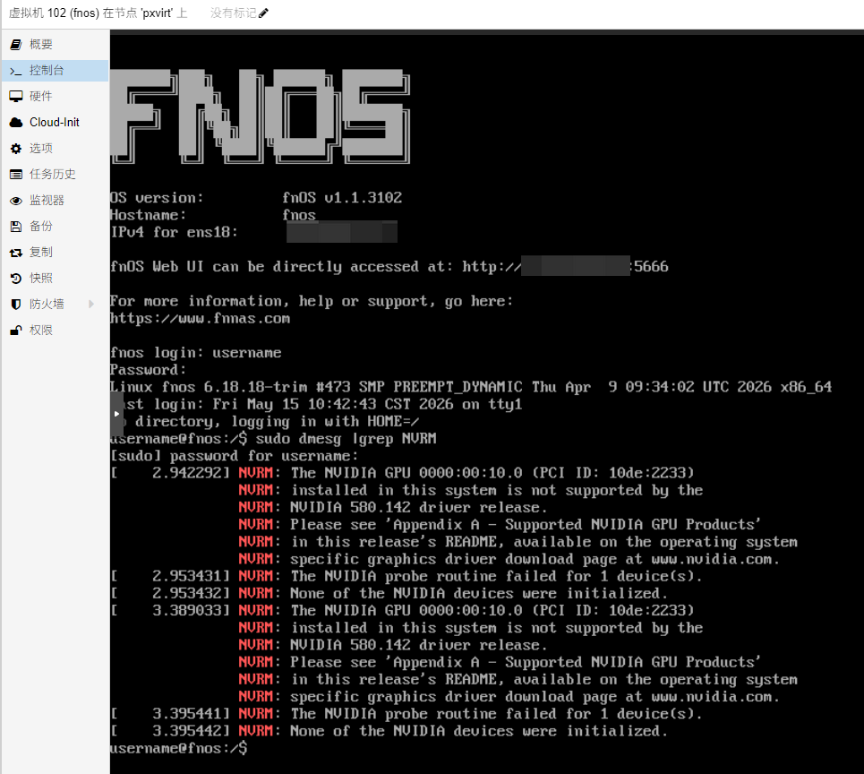

本项目提供的是匹配 vGPU / GRID 场景的驱动包。请不要同时安装或启用飞牛官方应用中心里的 NVIDIA 驱动应用，否则一定会出现冲突。

## 3. 下载驱动包

### 3.1 打开 GitHub Release 页面

进入项目 Release 页面：

```text
https://github.com/fnnas/appstore.driver.gpu.nvidia.grid/releases
```

选择当前版本，例如：

```text
580.159.03-3
```

如果宿主机使用 GRID 16.14 分支，则选择：

```text
535.309.01-1
```

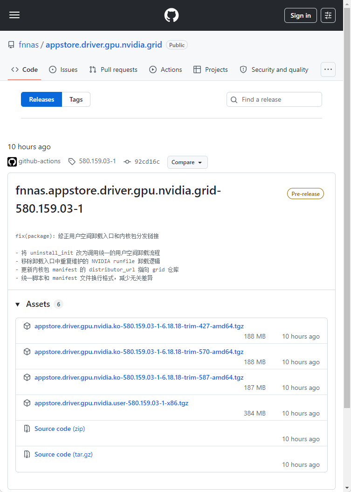

你需要下载两个包：

1. 一个内核驱动包，根据 `uname -a` 的 build number 选择。
2. 一个同版本用户空间驱动包，例如 `appstore.driver.gpu.nvidia.user-580.159.03-3-x86.tgz.fpk`。

以 `#473` 内核为例，应下载：

```text
appstore.driver.gpu.nvidia.ko-580.159.03-3-6.18.18-trim-427-amd64.tgz.fpk
appstore.driver.gpu.nvidia.user-580.159.03-3-x86.tgz.fpk
```

GRID 16.14 / `535.309.01` 的同版本示例是：

```text
appstore.driver.gpu.nvidia.ko-535.309.01-1-6.18.18-trim-427-amd64.tgz.fpk
appstore.driver.gpu.nvidia.user-535.309.01-1-x86.tgz.fpk
```

### 3.2 使用 FNOS 下载工具下载

可以在 FNOS 下载工具里添加 Release 资源链接。

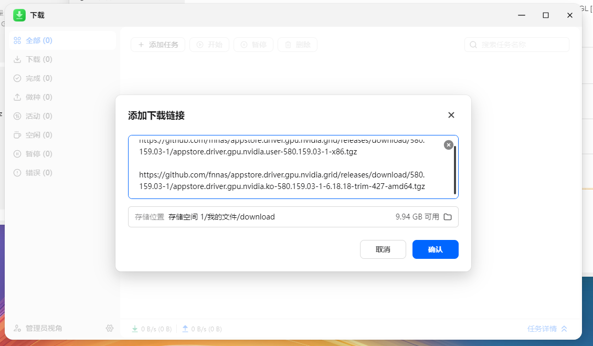

如果下载工具支持多个链接，可以一次性添加内核驱动包和用户空间驱动包。

### 3.3 确认文件扩展名

当前 GitHub Release 上传的安装包已经是 `.tgz.fpk` 扩展名，可以直接用于 FNOS 本地应用安装入口。

确认你下载到的文件名应类似：

```text
appstore.driver.gpu.nvidia.ko-580.159.03-3-6.18.18-trim-427-amd64.tgz.fpk
```

用户空间驱动包同样应是 `.tgz.fpk`：

```text
appstore.driver.gpu.nvidia.user-580.159.03-3-x86.tgz.fpk
```

选择 535 版本时对应为：

```text
appstore.driver.gpu.nvidia.user-535.309.01-1-x86.tgz.fpk
```

#### 我下载的是tgz而不是fpk?

如果你下载的是 GitHub Actions artifact 或历史发布中的 `.tgz` 文件，才需要手动把扩展名改为 `.tgz.fpk`。

```text
appstore.driver.gpu.nvidia.ko-580.159.03-3-6.18.18-trim-427-amd64.tgz
appstore.driver.gpu.nvidia.ko-580.159.03-3-6.18.18-trim-427-amd64.tgz.fpk
```

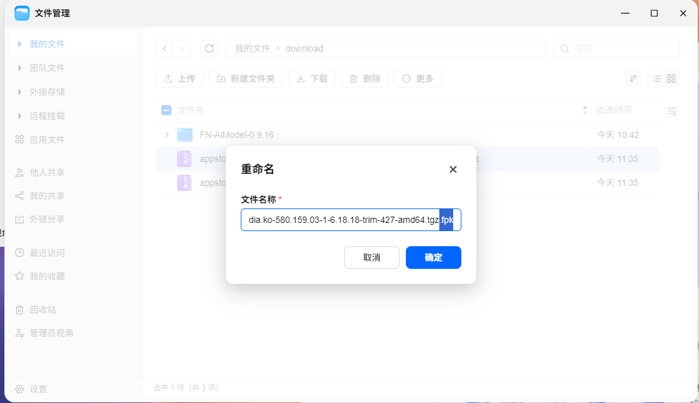

## 4. 安装内核空间驱动

### 4.1 安装内核驱动包

打开 FNOS 应用中心或本地安装入口，选择下载到的 `.tgz.fpk` 内核驱动包：

```text
appstore.driver.gpu.nvidia.ko-580.159.03-3-6.18.18-trim-427-amd64.tgz.fpk
```

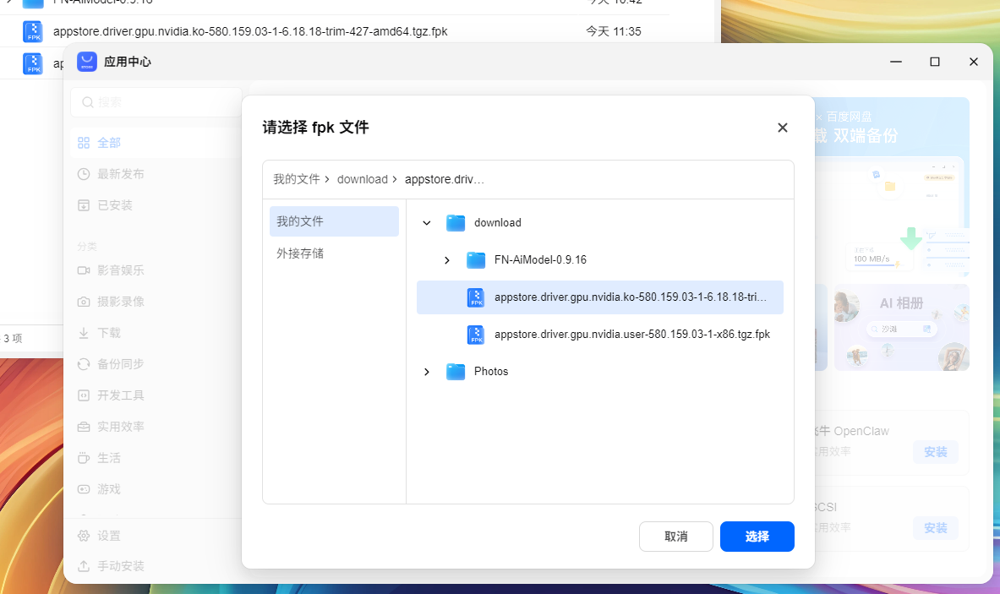

安装时请确认包名是 `appstore.driver.gpu.nvidia.ko`，不要先安装用户空间驱动包。

### 4.2 等待安装完成

内核驱动安装过程会完成以下动作：

- 安装 NVIDIA kernel module
- 安装 NVIDIA firmware
- 切换系统 NVIDIA 模块 alternatives
- 执行 `depmod`
- 禁用 nouveau
- 执行 `update-initramfs -u`

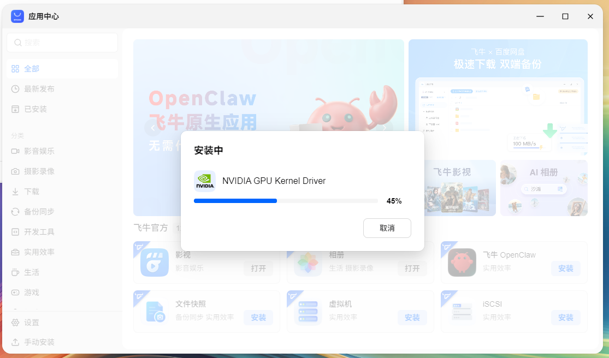

如果安装失败，应用中心会显示明确错误信息。常见原因包括：

- 内核包选错
- 没有与当前 `uname -r` 对应的内核驱动包
- firmware 缺失
- initramfs 更新失败

### 4.3 重启系统

内核驱动安装完成后，建议立即重启 FNOS。

需要注意这里的状态应该变为停止，才是安装完成。

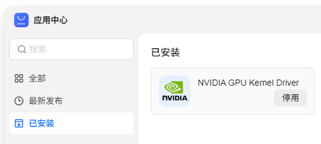

重启后系统会加载新的 NVIDIA 内核模块。

### 4.4 确认内核驱动正常工作

重启后进入控制台或 SSH，执行：

```bash
sudo dmesg | grep -E "NVRM|nvidia"
```

正常情况下可以看到类似信息：

```text
NVRM: loading NVIDIA UNIX x86_64 Kernel Module 580.159.03
nvidia-modeset: Loading NVIDIA Kernel Mode Setting Driver for UNIX platforms 580.159.03
[drm] [nvidia-drm] [GPU ID ...] Loading driver
```

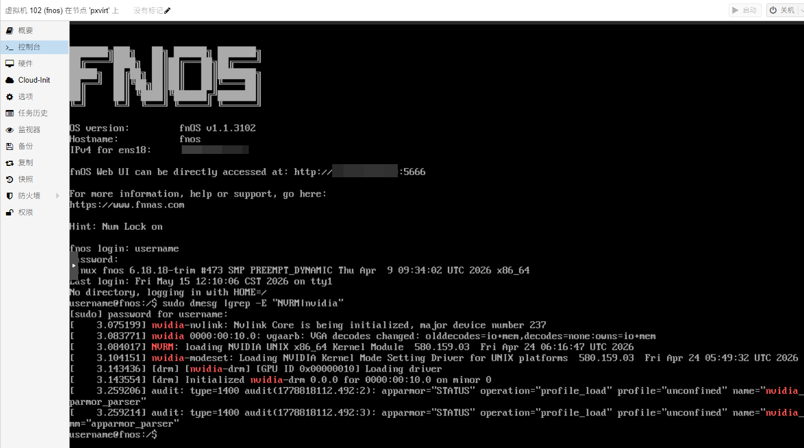

也可以进一步执行：

```bash
cat /proc/driver/nvidia/version
```

正常输出应包含：

```text
NVIDIA UNIX x86_64 Kernel Module  580.159.03
```

如果这里还是旧版本，或者没有 `/proc/driver/nvidia/version`，说明内核驱动没有正确加载，需要检查是否安装了正确的内核驱动包，并确认已经重启。

## 5. 安装用户空间驱动

### 5.1 安装用户空间驱动包

确认内核驱动已经正常加载后，再安装用户空间驱动包：

```text
appstore.driver.gpu.nvidia.user-580.159.03-3-x86.tgz.fpk
```

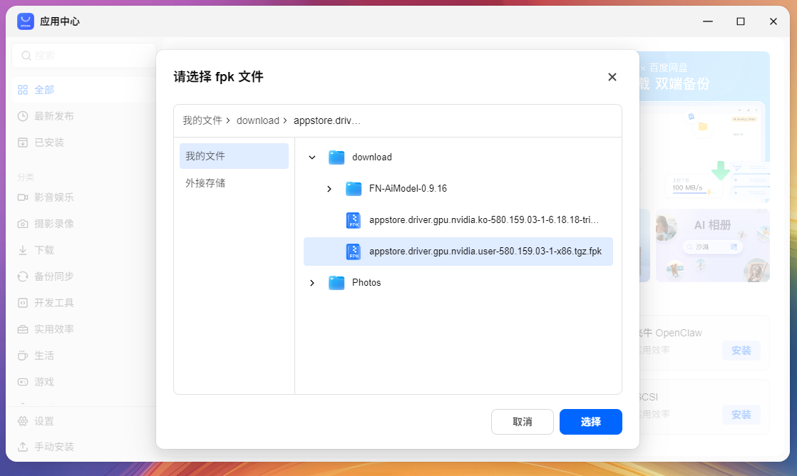

用户空间驱动安装前会检查：

```text
/proc/driver/nvidia/version
```

只有当前内核空间驱动版本是 `580.159.03` 时才会继续安装。这样可以避免用户空间库和内核模块版本不一致。

如果安装的是 `535.309.01-1` 用户空间包，则这里只允许当前内核空间驱动版本为 `535.309.01`。

### 5.2 等待用户空间驱动安装完成

用户空间驱动安装过程会执行 NVIDIA `.run` 安装器，但不会安装内核模块，也不会启用 DKMS。

安装 `580.159.03-3` 用户空间包时还会安装 NVLTS，并重启依赖 NVIDIA 用户空间库的系统服务。`535.309.01-1` 用户空间包不包含也不会安装 NVLTS。

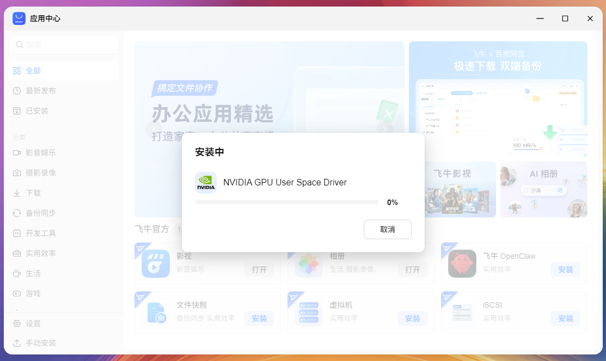

安装完成后首次启动**可能**会失败，此时重启机器即可

如果反复安装失败，优先检查：

- 是否已经安装并重启内核驱动
- `/proc/driver/nvidia/version` 是否是所选用户空间包对应的驱动版本
- 用户空间驱动包是否和内核驱动包版本一致
- 必要时在issue提交系统日志

### 5.3 确认用户空间驱动正常工作

安装完成后进入控制台或 SSH，执行：

```bash
nvidia-smi
```

正常情况下可以看到：

- `NVIDIA-SMI 580.159.03`
- `Driver Version: 580.159.03`
- GPU 型号
- 显存容量

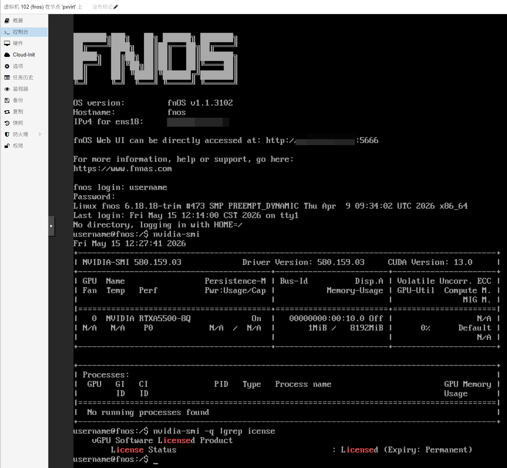

如果使用 GRID / vGPU 授权，还可以执行：

```bash
nvidia-smi -q | grep -i license
```

正常情况下可以看到类似：

```text
vGPU Software Licensed Product
License Status : Licensed
```

如果 `nvidia-smi` 命令不存在，通常说明用户空间驱动没有安装成功。

如果 `nvidia-smi` 能运行但看不到 GPU，通常说明内核驱动没有正常加载或 vGPU 没有正确分配给虚拟机。

## 6. 配置和使用影视转码

### 6.1 打开影视转码设置

进入 FNOS 影视相关应用的设置页面，打开`启用 GPU 加速转码`选项。

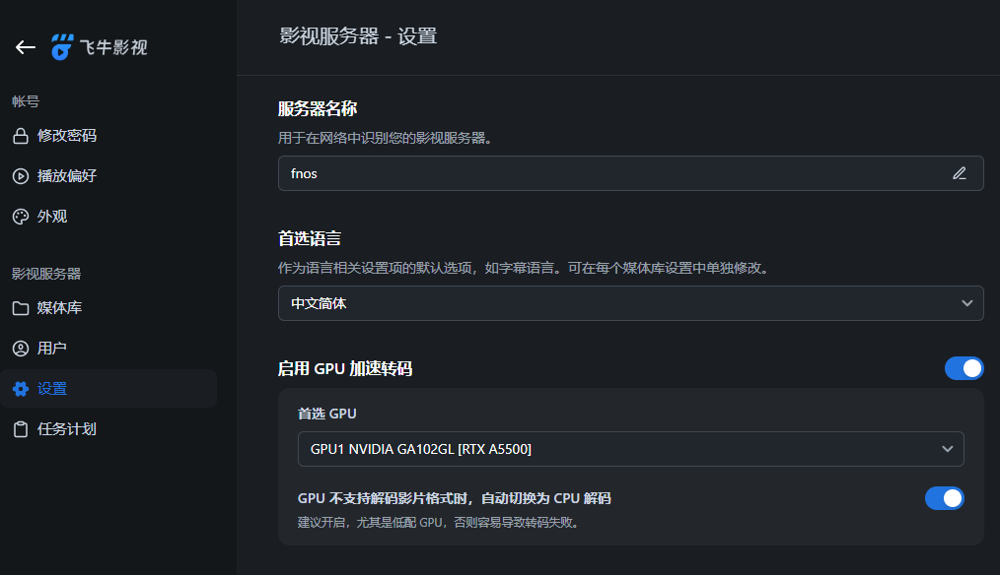

不然容易自己演自己。

### 6.2 播放视频并观察 GPU 使用情况

选择一个需要转码的视频进行播放。

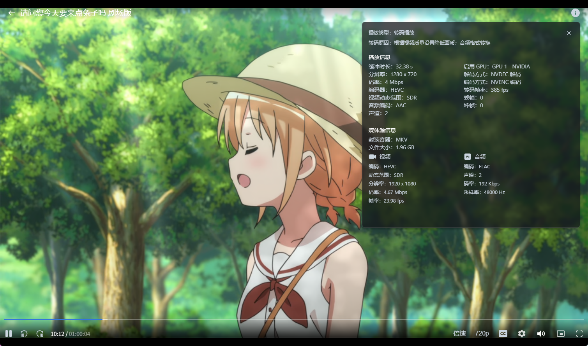

播放时可以在播放页面查看是否启用了GPU编解码

还可以通过系统资源管理器观察 GPU 页面，或使用命令查看：

```bash
nvidia-smi
```

如果硬件转码生效，通常可以看到：

- 视频播放过程中 GPU 显存占用变化
- GPU Decoder / Encoder 指标变化
- `nvidia-smi` 中出现相关进程

如果没有变化，建议检查：

- 当前视频是否真的触发转码，而不是直接播放
- 影视应用中是否已经启用硬件转码
- 用户空间驱动是否正常安装
- 系统资源管理器是否能看到 GPU

## 7. 配置和使用相册 AI 加速

进入相册应用，启用需要 GPU 加速的功能，例如 人脸识别、智能识别。

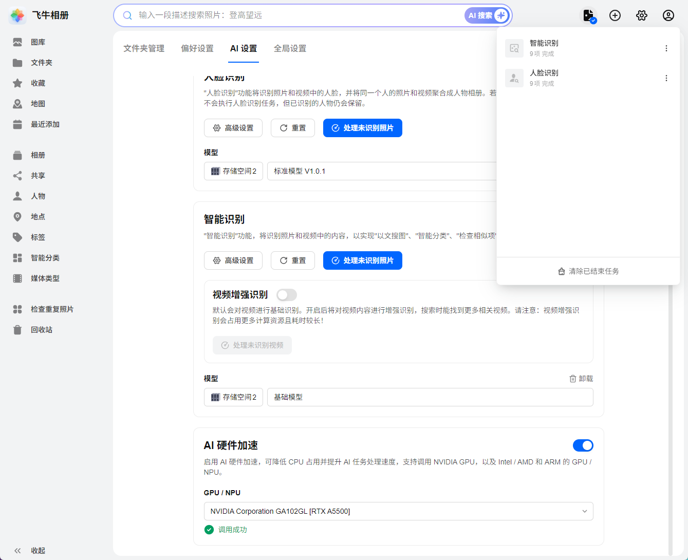

使用相册 AI 功能时，可以同时打开资源管理器观察 GPU 使用率、显存使用量是否变化。也可以在 SSH 中执行：

```bash
watch -n 1 nvidia-smi
```

如果任务运行时 GPU 显存或 GPU-Util 有变化，通常说明 AI 加速已经调用到 NVIDIA 驱动。

## 8. 确认系统信息识别正常

驱动安装完成后，打开系统设置和资源管理器。

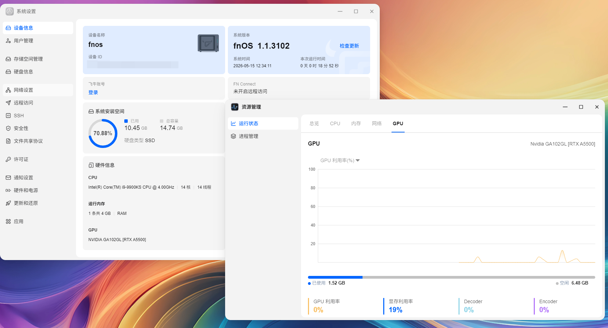

正常情况下可以看到：

- 系统设置的硬件信息中出现 NVIDIA GPU
- 资源管理器中出现 GPU 标签页
- GPU 页面显示显存、利用率、Encoder、Decoder 等指标

如果系统设置中能看到 GPU，但资源管理器没有 GPU 页，可以尝试：

```bash
sudo systemctl restart sysinfo_service.service
sudo systemctl restart ai_manager.service
sudo systemctl restart mediasrv.service
sudo systemctl restart resmon_service.service
```

用户空间驱动包安装完成后会自动重启这些服务；这里的命令主要用于手动排查。

## 9. 常见问题

### 9.1 应该先安装哪个包？

必须先安装内核驱动包：

```text
appstore.driver.gpu.nvidia.ko-...
```

安装完成并重启，确认内核驱动正常后，再安装用户空间驱动包：

```text
appstore.driver.gpu.nvidia.user-...
```

### 9.2 内核驱动包选错会怎样？

选错内核驱动包可能导致：

- 应用安装失败
- `nvidia.ko` 版本或 vermagic 不匹配
- 重启后 NVIDIA 模块无法加载
- `dmesg` 中出现模块加载错误

请重新执行：

```bash
uname -a
```

按 build number 重新选择对应内核驱动包。

### 9.3 安装后为什么一定要重启？

内核驱动安装时会禁用 nouveau、切换 NVIDIA 内核模块 alternatives，并更新 initramfs。重启可以确保系统从启动阶段就加载新的 NVIDIA 模块和 firmware。

### 9.4 可以和飞牛官方 NVIDIA 驱动一起用吗？

完全不行。两个驱动是冲突的，会打架。

就算是在应用中心卸载了，你也要检查有没有残留。

### 9.5 如何确认当前驱动版本？

内核空间版本：

```bash
cat /proc/driver/nvidia/version
```

用户空间版本：

```bash
nvidia-smi
```

两边都应该显示：

```text
580.159.03
```

如果安装的是 `535.309.01-1`，两边都应该显示：

```text
535.309.01
```

### 9.6 安装失败后怎么办？

优先按顺序检查：

1. 是否已经给虚拟机打快照，打了快照可以回滚再试试。
2. 宿主机 vGPU KVM 驱动和客户机 GRID 驱动是否来自匹配的 vGPU 驱动版本组合。
3. 内核版本和 build number 是否选对。
4. 是否先安装内核驱动，重启后再安装用户空间驱动。
5. 是否还安装着飞牛官方 NVIDIA 驱动。
6. `dmesg` 是否有 NVIDIA 相关错误。

如果系统状态异常，最稳妥的处理方式是回滚安装前创建的虚拟机快照。

### 9.7 宿主机 vGPU KVM 驱动和客户机 GRID 驱动为什么要匹配？

vGPU 场景下，宿主机驱动负责创建和管理虚拟 GPU，客户机 GRID 驱动负责在 FNOS 虚拟机内识别和使用这个虚拟 GPU。两边需要使用同一套 NVIDIA vGPU 驱动发布包中的匹配版本。

本文示例中：

```text
宿主机 vGPU KVM 驱动：580.159.01
客户机 GRID 驱动：580.159.03
```

这两个版本来自同一套 vGPU 驱动组合，因此可以配套使用。`535.309.01` 则应使用 GRID 16.14 分支对应的宿主机和客户机组合。升级时也应同时关注宿主机驱动和客户机驱动，不建议只单独替换其中一边。
